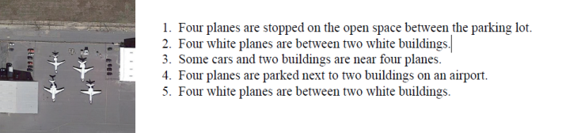
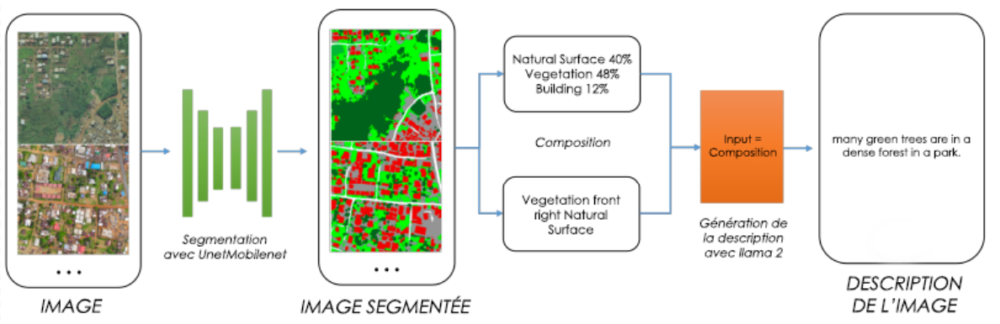
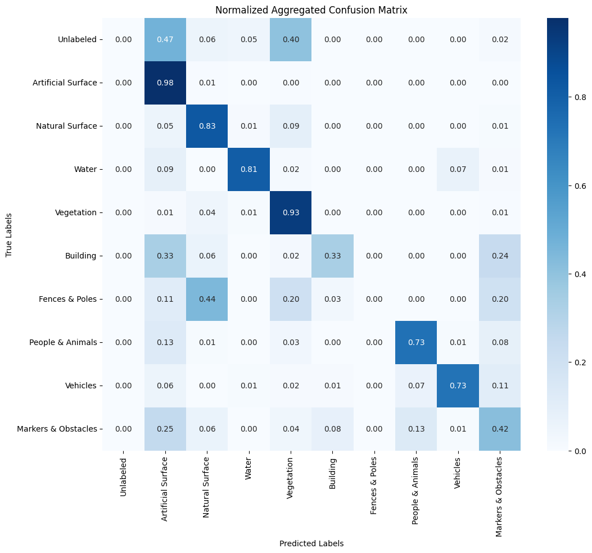
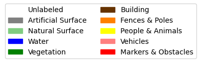
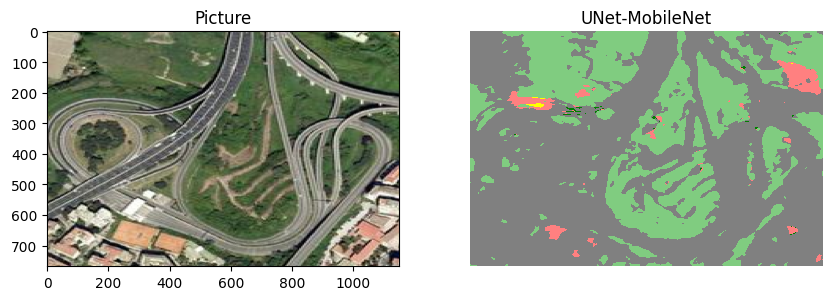
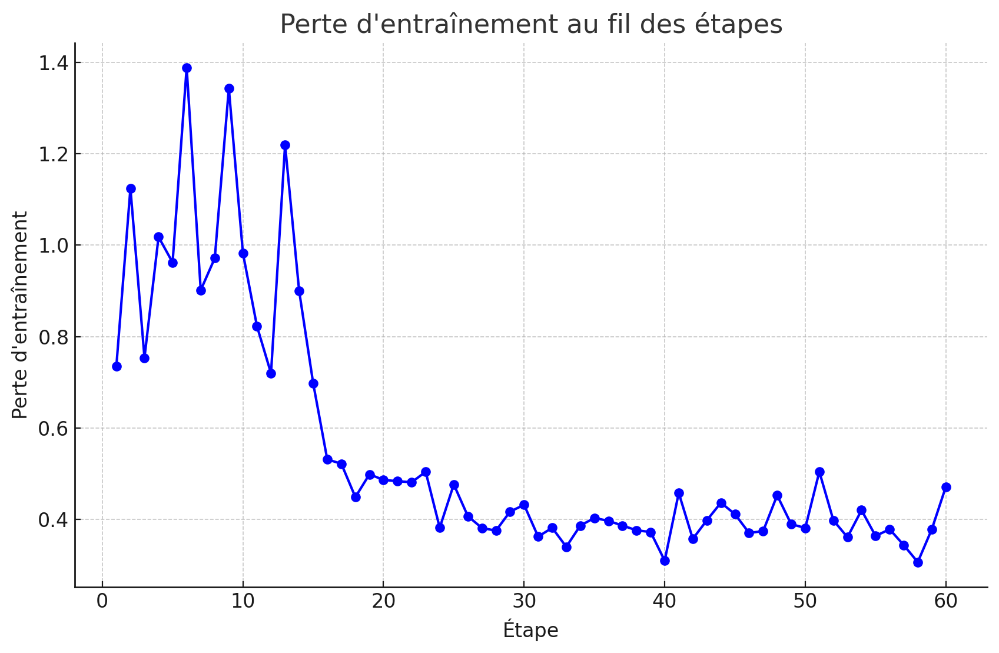
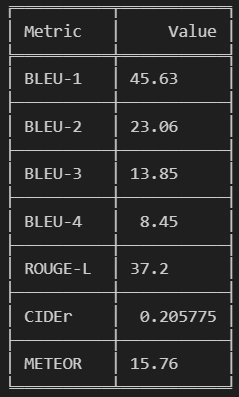
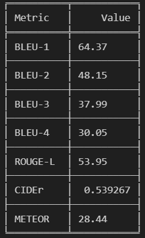

# **Générer des légendes à partir d'une image**

1. [Introduction](README.md#introduction)
2. [Dataset : RSCID](README.md#dataset--rscid)
3. [Segmentation du dataset RSCID](README.md#segmentation-du-dataset-rscid)
4. [Calcul statistique et composition des images](README.md#calcul-statistique-et-composition-des-images)
4. [Entrainement du LLM llama2](README.md#entrainement-du-llm-llama2)
5. [Evaluation du LLM](README.md#evaluation-du-LLM)
6. [Sources et documentation](README.md#sources-et-documentation)

## Introduction

Générer des légendes à partir d'image consiste à prédire une description textuelle, ce qui la rend précieuse pour les informations qu'elle renseigne. Cette tâche est particulièrement pertinente dans la télédétection, où de vastes quantités d'images sont continuellement collectées. Dans ce projet, j'ai exploré une approche basée sur la segmentation pour "comprendre" la composition d'une image, puis j'ai utilisé un modèle de langage pour générer des légendes à partir des compositions extraites.



*Figure 1 : Image de télédétection avec ses légendes (dataset RSCID)*



*Figure 2 : Schéma de la tâche effectuée*


## **Dataset : RSCID**

Le dataset **RSCID** ("Remote Sensing Captioning Image Dataset") est un dataset dédié au légendage d'images dans le domaine de la télédétection. Il est composé de 10.921 images, : toutes accompagnées de cinq descriptions textuelles détaillées, créées par des humains. La particularité de ce dataset, c'est qu'il ne contient que 3.323 mots différents pour 54.605 légendes. (Certaines phrases ont été dupliquées pour avoir effectivement cinq descriptions par image.)

Ce dataset est basée sur "UCM-(captions) dataset" et "Sydney-(captions) dataset". Ci-dessous le lien du dataset : [Google Drive - RSCID](https://drive.google.com/drive/folders/19lYK-79D-KceYTM1RarjPxk-TBwstdSI?usp=drive_link)


## **Segmentation du dataset RSCID**

La première difficulté de ce sujet réside dans la tâche de segmentation. Comme le dataset ne comporte pas de données sur la segmentation des images qu'il contient, il n'est pas aisé de faire une tâche de segmentation classique. On ne peut donc pas réaliser d'évaluation objective sans les données labelisés.

Une solution est alors introduite : entrainer un modèle de segmentation avec un autre dataset, proche du dataset RSCID, pour pouvoir avoir un modèle assez performant.

C'est ici qu'on introduit le dataset AID (Aerial Image Dataset).

### **Présentation du dataset AID**

J'ai choisi ce dataset parce qu'il est basé sur les mêmes images que le dataset RSCID. Le dataset AID est essentiellement basé, lui aussi, sur "UCM-(segmentations) dataset". Quant à lui, AID possède beaucoup moins d'images que le dataset RSCID mais peut être très utile dans cette tâche de segmentation. Il est composé de 23 classes différentes ("unlabeled", "paved-area", "dirt", "grass", "gravel", "water", "rocks", "pool", "vegetation", "roof", "wall", "window", "door", "fence", "fence-pole", "person", "dog", "car", "bicycle", "tree", "bald-tree", "ar-marker", "obstacle", "conflicting") et un total de 400 images.

Avoir autant de classe est une très bonne chose pour la précision des description, mais les classes sont très proches. Par exemple, faire la différence entre "grass" et "tree" est très précis. Pour limiter le taux d'erreur et ne garder que l'essentiel, j'ai décidé de regrouper certaines classes entre elles. J'ai donc au total dix classes :

```py
classes = {
    'Unlabeled' : 'unlabeled'
    'Artificial Surface' : 'paved-area', 'roof'
    'Natural Surface' : 'dirt', 'gravel', 'rocks'
    'Water' : 'water', 'pool'
    'Vegetation' : 'grass', 'vegetation', 'tree', 'bald-tree'
    'Building' : 'wall', 'window', 'door'
    'Fences & Poles' : 'fence', 'fence-pole'
    'People & Animals' : 'person', 'dog'
    'Vehicles' : 'car', 'bicycle'
    'Markers & Obstacles' : 'ar-marker', 'obstacle'
}
```

*Code 1 : Répartition des classes en groupe*

Ci-dessous le lien du dataset AID : [Google Drive - AID](https://drive.google.com/drive/folders/1Tnhm-qxDZvaFPDoBa1VbEHBaFg2DuUrE?usp=drive_link)

### **Présentation du modèle utilisé**

Pour la tâche de segmentation, j'ai utilisé le modèle "Unet-MobileNet". Ce modèle combine la puissance de l'architecture U-Net, connue pour ses excellentes performances en segmentation d'images, avec l'efficacité et la légèreté de MobileNet, un réseau de neurones convolutifs optimisé pour les appareils mobiles.

N'ayant pas/peu de GPU disponible, il me fallait une architecture simple, pas trop gourmande en ressources et rapide d'utilisation.

Pour cela, U-Net fournit une architecture en forme de "U" avec des couches d'encodage et de décodage permettant une segmentation précise, tandis que MobileNet offre des convolutions séparables en profondeur, réduisant le nombre de paramètres et la complexité computationnelle. Cette combinaison permet d'obtenir un modèle performant et rapide, adapté à l'analyse des images de télédétection de grande échelle.


### **Présentation des résultats sur le dataset AID**


Ci-dessous la matrice de confusion des classes regroupantes.



*Figure 3 : Matrice de confusion - UnetMobileNet x AID*

Après une analyse des résultats, les résultats ne sont pas trop mals : il y a une précision moyenne de 86% et un taux "IoU" de 35% qui peut être expliqué par un déséquilibre des classes. Par exemple, sur les images de télédétection, il y a un pourcentage de pixels appartenant à l'environnement ("Artificial Surface" / "Vegetation") très élevé que le pourcentage de pixels appartenant aux individus.

### Segmentation sur le dataset RSCID

Après avoir entrainé le modèle sur le dataset AID, il suffit d'utiliser le modèle sur toutes les images du dataset RSCID. Ci-dessous une image d'autoroute et sa segmentation :



*Figure 4 : Légende - Classes et leurs couleurs*




*Figure 5 : Dataset RSCID - Autoroute et sa segmentation*

## **Calcul statistique et composition des images**

La tâche de segmentation est une tâche très utile, car elle permet de calculer et d'analyser la composition d'une image. Cette composition sera les données d'entrées du LLM. Pour calculer sa composition, j'ai besoin de trois informations pour chaque image : 

1. Le taux d'occurence de chaque classe : (Nombre de pixels de la classe C / Nombre de pixels total) * 100
2. L'emplacement du centre de chaque classe : les coordonnées du centroïde du cercle englobant chaque classe 
3. Les positions de chaque classe par rapport aux classes majorantes : comparaison des centres de chaque classe

```py
def compare_coordinates(closest, coordinates):
  comparisons = []

  for coord, neight in closest.items():
    coord_x, coord_y = coordinates[coord]
    neighbor_x, neighbor_y = coordinates[neight]

    if coord_x < neighbor_x:
      if coord_y < neighbor_y:
        comparisons.append((coord, "front right", neight))
      elif coord_y > neighbor_y:
        comparisons.append((coord, "behind right", neight))
      else:
        comparisons.append((coord, "to the right of", neight))
    elif coord_x > neighbor_x:
      if coord_y < neighbor_y:
        comparisons.append((coord, "front left", neight))
      elif coord_y > neighbor_y:
        comparisons.append((coord, "behind left", neight))
      else:
        comparisons.append((coord, "to the left of", neight))
    else:
      if coord_y < neighbor_y:
        comparisons.append((coord, "in front", neight))
      elif coord_y > neighbor_y:
        comparisons.append((coord, "behind", neight))
      else:
        comparisons.append((coord, "on", neight))

  return comparisons
```

*Code 2 : Calcul pour comparer l'emplacement de deux centroïdes*

Avec cette analyse, je possède enfin la composition de chacune de mes images.

## Entrainement du LLM llama2

Après avoir calculé toutes les compositions de notre dataset,il est maintenant temps d'entrainer le modèle de langage qui permettra de générer les descriptions. Pour l'entrainement du modèle, je me base sur la séparation suivante : 1.092 compositions pour les tests et descriptions (prises au hasard entre les cinq phrases du dataset RSCID) et donc 9.815 compositions (initialement 9.829 mais avec la suppression des doublons, 9.815 compositions) pour l'entrainement.



*Figure 6 : Courbe de la perte d'entrainement avec 60 époques*

## Evaluation du LLM

Suite à l'entrainement du LLM, le modèle devient de plus en plus précis. L'évaluation d'un LLM est très compliquée : on ne peut donc pas utiliser les métriques classiques comme la précision ou le rappel pour évaluer les performances de la tâche. Pour cela, on introduit différentes métriques comme :

- **BLEU-n** : En comparant des séquences de mots appelées n-grammes (groupes de n mots). Un score BLEU élevé indique que la légende générée contient des séquences de mots similaires à celles des légendes de référence, reflétant ainsi une bonne qualité de génération de texte.
- **ROUGE** : Elle compare les plus longues sous-séquences communes entre la légende générée et les légendes de référence.
- **CIDEr** : Cette métrique utilise la fréquence TF-IDF ("Term Frequency-Inverse Document Frequency") pour pondérer les mots et comparer les légendes générées aux légendes de référence.
- **METEOR** : prend en compte les correspondances flexibles entre les mots et les synonymes, ainsi que la précision et le rappel.

**Exemple :**

```py
Légende de référence : 
1. "Un chien joue avec une balle dans le parc."
2. "Un chien court après une balle dans un espace vert."
Légende générée : "Un chien court et joue avec une balle dans le parc."

BLEU-1 (unigrammes) : 
Correspondances : "Un", "chien", "court", "joue", "avec", "une", "balle", "dans", "le", "parc"
Score BLEU-1 = 91%
BLEU-2 (bigrammes) : 
Correspondances : "Un chien", "chien court", "avec une", "joue avec", "une balle", "balle dans", "dans le", "le parc"
Score BLEU-2 = 85%
BLEU-3 (trigrammes) : 
Correspondances : "Un chien joue", "joue avec une", "avec une balle", "une balle dans", "balle dans le", "dans le parc"
Score BLEU-3 = 78% 
BLEU-4 (quadgrammes) :
Correspondances : "joue avec une balle", "avec une balle dans", "une balle dans le"
Score BLEU-4 = 70%

ROUGE-L
Plus longue sous-séquence commune (LCS) : "joue avec une balle dans le parc"
Score ROUGE-L = 91% (toute la légende générée correspond à une séquence dans la légende de référence)

CIDEr
Correspondances pondérées par TF-IDF : "chien", "balle", "une", "dans"
Score CIDEr = 1 

METEOR
Synonymes et variantes : "court" (synonyme de "joue")
Score METEOR = 54%
```

*Code 3 : Application des différentes métriques sur un exemple simple*

En applicant les mêmes métriques sur le set des données de test, j'obtiens les résultats ci-dessous. Les résultats ne sont pas très performants, mais il peut y avoir plusieurs raisons. Les objets présents sur les images ne sont pas facilement reconnaissable : par exemple, UnetMobilenet a eu beaucoup de mal à reconnaitre les bâtiments des aéroports ou d'autres batiments cités dans la base de données RSCID.  



*Figure 7 : Evaluation du modèle LLM sur toute la base de données de test* 

Lorsque les images sont trop précises et comportent des thèmes non descriptifs comme les aéroports, les autoroutes ou les fermes, le modèle a dû mal à bien générer leur description. Cependant, lorsqu'on ne prend que des images essentiellements composées que d'éléments naturels comme les forêt, le score augmente drastiquement.



*Figure 8 : Evaluation du modèle LLM sur toute la base de données de test comportant des parcs*

## Sources et documentation

[1] Lu, Xiaoqiang, et al. "Exploring models and data for remote sensing image caption
generation." IEEE Transactions on Geoscience and Remote Sensing 56.4 (2017): 2183-2195.

[2] Sharma, Megha, and Yoshimasa Tsuruoka. ["Towards Unsupervised Remote Sensing Image
Captioning and Retrieval with Pre-Trained Language Models."](https://www.anlp.jp/proceedings/annual_meeting/2023/pdf_dir/B10-4.pdf) Proceedings of the 29th Annual
Meeting of the Association for Natural Language Processing. 2023.

[3] Sumbul, G., Nayak, S., & Demir, B. (2020). SD-RSIC: Summarization-driven deep remote sensing image captioning. IEEE Transactions on Geoscience and Remote Sensing, 59(8), 6922-6934.

[4] Ronneberger, O., Fischer, P., & Brox, T. (2015). U-net: Convolutional networks for biomedical image segmentation. In Medical image computing and computer-assisted intervention–MICCAI 2015: 18th international conference, Munich, Germany, October 5-9, 2015, proceedings, part III 18 (pp. 234-241). Springer International Publishing.

[5] Bi, Q., Zhou, B., Qin, K., Ye, Q., & Xia, G. S. (2022). All grains, one scheme (AGOS): Learning multigrain instance representation for aerial scene classification. IEEE Transactions on Geoscience and Remote Sensing, 60, 1-17.

[6] Xia, G. S., Hu, J., Hu, F., Shi, B., Bai, X., Zhong, Y., ... & Lu, X. (2017). AID: A benchmark data set for performance evaluation of aerial scene classification. IEEE Transactions on Geoscience and Remote Sensing, 55(7), 3965-3981.

[7] Zheng, Y., Zhang, R., Zhang, J., Ye, Y., Luo, Z., & Ma, Y. (2024) ["LlamaFactory: Unified Efficient Fine-Tuning of 100+ Language Models."](http://arxiv.org/abs/2403.13372), Unsloth.ai
